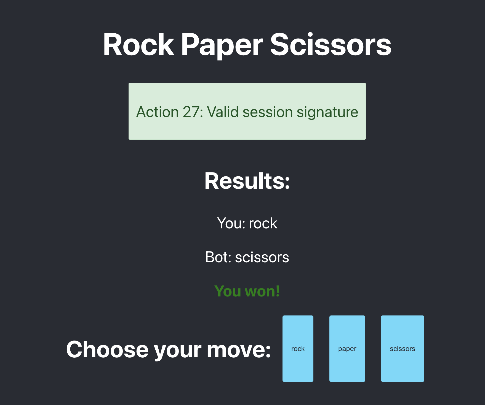

# No-Wallet-Confirmation Rock Paper Scissors with Sequence

This tutorial demonstrates how to create a simple Rock Paper Scissors game using the Sequence Wallet and session keys for streamlined user interactions.

## About Session Keys

Session keys are ephemeral private keys that can be generated and stored client-side, typically in a user's local storage. They provide a convenient and secure way for users to authorize specific actions in a decentralized application without requiring them to confirm each action through their primary wallet.

By signing a message with their primary wallet (e.g., Sequence Wallet), users can authorize a session key to act on their behalf for a limited time or scope. Applications can then interpret signed messages from the session key as if they were coming directly from the user's wallet, streamlining the user experience.

Session keys are particularly useful for applications that require frequent user interactions, as they help reduce the number of wallet confirmations needed, while still maintaining a secure and verifiable authentication process.

## Getting Started

1. Clone the repository.
2. Install the required dependencies: `npm install`.
3. Start the development server: `npm start`.

The application will open in your default web browser at `http://localhost:3000`.

## How to Use

1. Connect to your Sequence Wallet by clicking the "Connect Sequence Wallet" button.
2. Generate a session key or load an existing one from local storage.
3. Authorize the session key by signing a message with your primary wallet.
4. Play the Rock Paper Scissors game by choosing a move.

The application uses the session key to sign each move without requiring confirmation from your primary wallet.

## Tutorial Overview

The tutorial covers the following steps:

- Setting up a basic React application
- Connecting to the Sequence Wallet
- Generating or loading a session key
- Authorizing the session key
- Playing the game using the session key for signing messages
- Verifying session key signatures
- Displaying the game results
